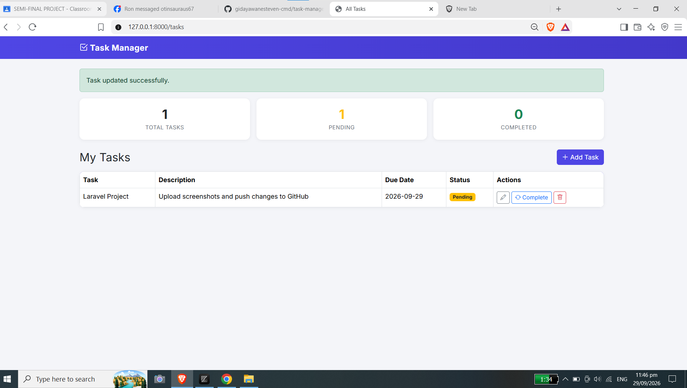
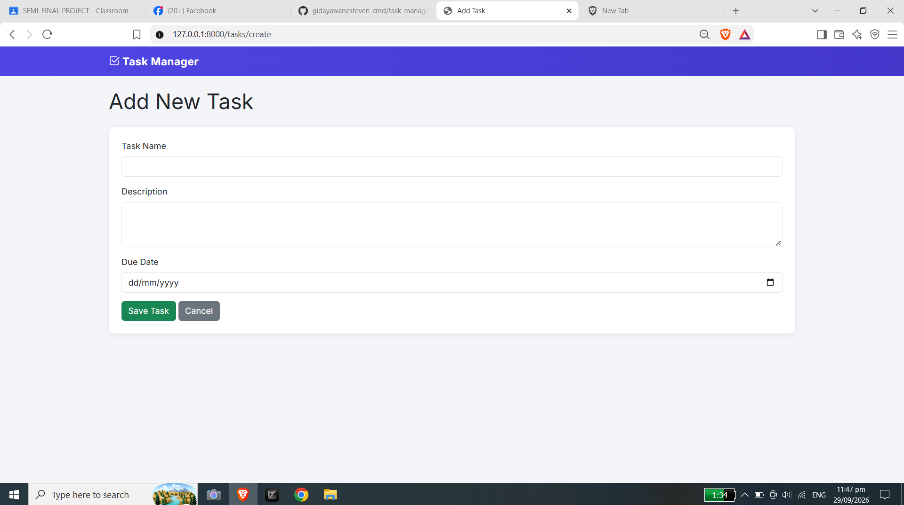
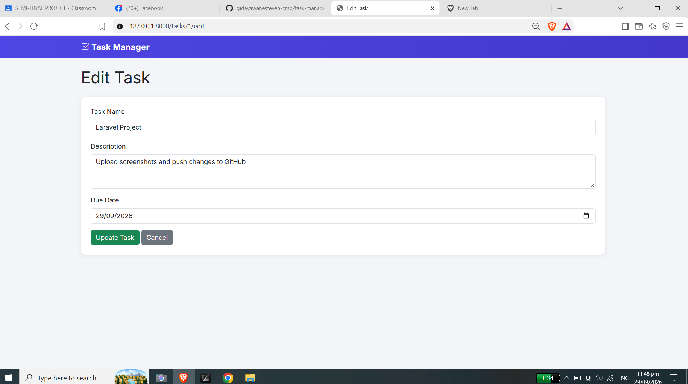

# Personal Task Manager

A simple Laravel-based task manager built as a mini project applying Routes → Controller → Model → Database → Blade.

| Field           | Detail               |
| :-------------- | :------------------- |
| _Project Code_  | WST21-PM-2026-SF     |
| _Student Name_  | Esteven L. Gidayawan |
| _Course & Year_ | BSIT-2               |
| _Database Used_ | MySQL                |
| _IDE Used_      | Zed Editor           |

---

## Features

- Add Task
- View Tasks
- Edit Task
- Delete Task
- Update Status (Pending / Completed)

## Bonus Features

- Dashboard-style stat cards (Total, Pending, Completed counts)
- Custom design theme with icons (Bootstrap Icons)

## Tech Stack

- _Framework:_ Laravel
- _Frontend:_ Blade Templating, Bootstrap 5, Bootstrap Icons
- _Database:_ MySQL
- _Editor:_ Zed

---

## Setup Instructions

1. _Clone the repository:_
    ```bash
    git clone https://github.com/gidayawanesteven-cmd/task-manager.git
    cd task-manager
    ```
2. **Install PHP dependencies:**
    ```bash
    composer install
    ```
3. **Set up environment configuration:**
    ```bash
    cp .env.example .env
    php artisan key:generate
    ```
4. **Configure Database:**
   Open `.env` in Zed Editor and update your database credentials:
    ```env
    DB_CONNECTION=mysql
    DB_HOST=127.0.0.1
    DB_PORT=3306
    DB_DATABASE=task_manager
    DB_USERNAME=root
    DB_PASSWORD=
    ```
5. **Run Migrations:**
    ```bash
    php artisan migrate
    ```
6. **Start Local Server:**
    ```bash
    php artisan serve
    ```

Access the app at: `http://127.0.0.1:8000/tasks`

---

## Screenshots




